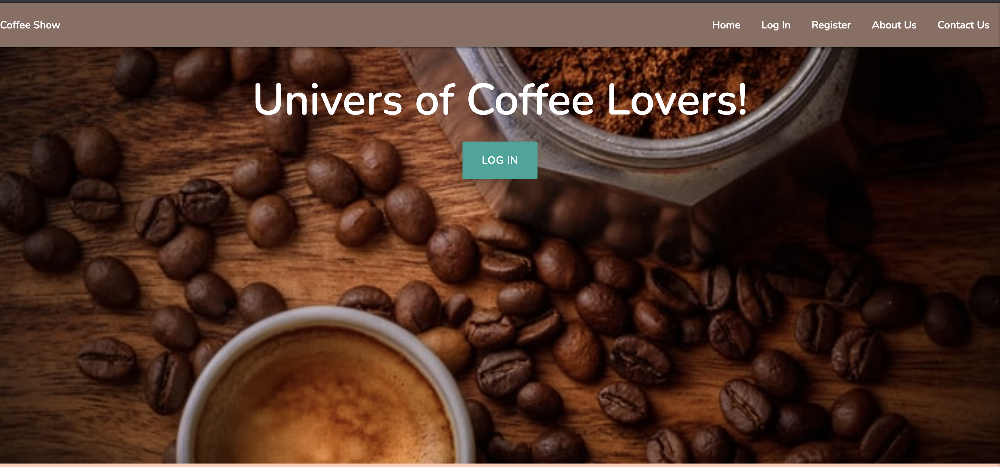
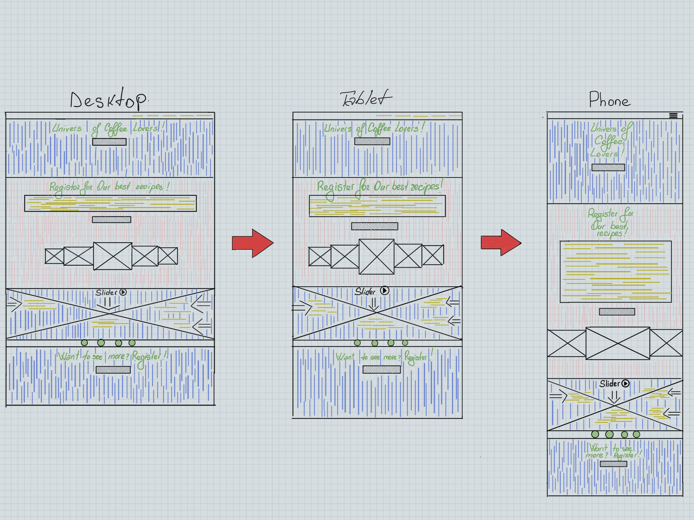

<!-- Milestone Project Nr 3 -->
><h1 align="center">Code Institute Data Centric Development Milestone Project</h1>
<!-- Title  -->

**<h1 align="center">Coffee Show</h1>**

<!-- Project Image -->
<h1 align="center"></h1>

<!-- Description of Project -->
<h4><strong><em>Coffee Show</em></strong> was inspired from the fact that what present reality is. All people that love coffee, should have the opportunity to make their loved drink themselves in home condition! As I am a coffee lover, working as a barista and like to experiment with coffee, I tried to simulate a website that are purely devoted to coffee and specifically to the simple steps you can follow, to achieve a cup of coffee home.,fast,easy and have a bit of fun.
</h4>

<!-- Contents List  -->

<!-- UX -->
# *User Experience* (UI/UX)

<h3>Project Goals</h3>

[CRUD](https://en.wikipedia.org/wiki/Create,_read,_update_and_delete) Functionality:
<ol>
<li>Create</li>
<li>Read</li>
<li>Update</li>
<li>Delete</li>
</ol>
<h4>This is Code Institute Data Centric Development module. Milestone Project 3. 

<em>The main goal of the project is the CRUD Functionality. The purpose of this particular project are to target audience that love coffee and would like to know how they can make it in home condition. My own goal was to create a simple website, which will contain just the information about coffee, steps of how to prepare recipe. Plain, simple and straight-to-the-point recipes.</em>

</h4>

### 1. <strong>User Stories</strong>  

> #### Guest User :

 - 1. As first time Traveler I would like to have a easy and smooth browse.
 - 2. As first time Traveler I would like to know what Website is about.
 - 3. As first time Traveler I would like to have a clean define Navigation bar.
 - 4. As first time Traveler I would like to know more about who is behind this website.
 - 5. As first time Traveler I would like know if I can contact them.
 - 6. As first time Traveler I would like to register and login. 
 - 7. As first time Traveler I would like to have access from all devices to my newly account.

> #### Registered User!
- 1. As a Registered User I would like to recieve a message if my registration went successfuly .
 - 2. As a Registered User I would like to as well would like to have a welcome message each time I'm Logged into my account.
 - 3. As a Registered User I would like to check all recipes.
 - 4. As a Registered User I would like to **Create** my own recipe.
 - 5. As a Registered User I would like to **Read** my own recipe.
 - 6. As a Registered User I would like to **Edit** my recipe.
 - 7. As a Registered User I would like to have opportunity to **Delete** my recipe.

> #### Developer Goals!
- 1. Practice CRUD Functionality.
- 2. Provide easy way of making homemade coffee.
- 3. Easy way of Creating, Reading, Editing and Deleting recipes.
- 4. Registration Functionality / LogIn Functionality / LogOut Functionality.
- 5. Practice more newly learn skills Jinja Template / Python3 / Flask.
- 6. Practice working with a database -> MongoDB.
- 7. Practice newly learn Framework *Materialeze*.
- 8. Improve JavaScript
- 9. Improve jQuery
- 10. Improve Creating clean code.
- 11. Learn working with Heroku.

<!-- DESIGN -->
## 2.<strong> Design</strong> 

<!-- Inspiration For Design -->
<strong>Inspiration:</strong> 

As I am very passionate about drinking, tasting and exploring everything related to coffee I start looking for existing coffee websites that are dedicated just to recipes and steps to follow. In this journey, I found little what I truly liked. My main idea then was, to be very simple, but in the same time to look appealing to visitor eys, to be easy to navigate and easier to understand how to follow the steps to make coffee. And for people who love coffee to be able to create fast and easy their own recipes, when they like to delete them or edit. As well, I portray the website without footer and just on the big devices to be able to have a dropdown list with each recipe individual page.

<strong>Frameworks Used:</strong>

In this project I choose to work with this Framework.

* - Materialeze
* - jQuery
* - Flask
 

<strong>Colors used:</strong>
<!-- Short Color Description -->

*  Colors

* -  I chose to use Materialeze color for mostly all Project, which is (*#8d6e63 brown lighten-1*, #ffccbc deep-orange lighten-4, #ffffff white, #eeeeee grey lighten-3)
* - On Profile page I choose to add a radial-gradient background image.
* - For Buttons I used same Materialeze color for all (*waves-light*) wich take a green color.

<!-- Icons Used for Project / Short Clear description -->
<strong>Icons Used</strong>
<!--Icon description  -->

* - [Fontawesome](fontawesome.com)
* - [Materialize](https://materializecss.com/icons.html)

<strong>Typography</strong>
<!-- Typography Description -->

* - [GoogleFonts](https://fonts.google.com/)
  - - On all webstie :  <em>'Nunito'</em>.
  - - Backing up :  <em>sans-serif</em>.

<strong>Imagery:</strong>
  - - Almost website contains images.
  - - All photos was picked with intent.
  - - Photos was placed to attract the quest eye.
  - - In time that you navigate the website, each of photo's purpose are to translate different emotions to quest.

<!-- Project Wireframes -->
### <strong>Wireframes</strong> 
<!-- Wireframes Goes Here -->
<h5>HOME PAGE</h5>
<h5 align="center"></h5>

# Features

> ### Existing Features

<!-- Existing features goes here -->
**Visible for all Users :** 
<!-- Accesible For All -->

- **All User have access to Home page**. 
On this page you are getting familiar with what website is about. You get a smooth transition on the page to a section which gives you a clear message to register and have access to all website recipes. 

- **All User have access to LogIn Page** 
The Log In Page is their first after Home page for the regular user to easy go an LogIn into his/her account.

- **All User have access to Register Page** 
The *Register* Page is right there after Log In. For users to get access to website they need to register. 

- **All User have access to About Us Page** 
This page is for users who want to know more about the website owners and who they are. To get a better understanding who is behind the website, who they are and why they do what they do.

- **All User have access to Contact Us Page** 
Contact Page is their for user to be able to be in touch, to add their remarks about the work they see or maybe for future collaborations.

<!-- Have Access Just If Registered -->
**Access Just After Registered :**
<!-- What registered quest can do after registered -->
- **Profile Page**
All users that decide to register will have their own Profile.When getting there, it will be displayed two correct ways of pouring and two buttons to redirect them to two pages: 
* 1. *All Recipes Page*
* 2. *Add Recipe Page*
- **All Recipes Page**
On this page, you can check already existing recipes and what the steps for making them and with what kind of tools.
- **Add Recipe Page**
When arriving on this page user can add their won recipes.
- **Read Recipe Page**
After you submitted your recipe, you will be redirected to the all recipe page. There you can check your recipe. As well as : 
* 1. *Edit*
* 2. *Delete*
- **Edit Recipe Page**
You can easy edit your submitted recipe on the *Edit Recipe Page*
- **Delete Recipe** 
Easy delete your submitted recipe by click Delete.
- **LogOut** 
Lastly, user have opportunity to LoggOut from their account when they want.

### `Feature Features left to impliment` 

From the beggining I didn't prioritize this Features but towards the end of the project was thinking more about this particular Features: 

- - 1.Edit Profile
- - 2.Delete Profile
- - 3.Manage Categories.
- - * *Add Category*
- - * *Edit Category*
- - * *Delete Category*

# Technologies Used

<!-- Here Goes Tech Used -->

- - i.[GitPod](https://www.gitpod.io/) 
    - Used GitPod for First choice as my ***IDE*** 
- - ii.[GitHub](https://github.com/) 
    - Used GitHub for Store my code. 
- - iii.[ideate](https://apps.apple.com/us/app/ideate-design-wireframe-ux/id1494036474) 
    - Used ideate to sketch Wireframes. 
- - iv.[HTML](https://developer.mozilla.org/en-US/docs/Web/Guide/HTML/HTML5) 
    - Used HTML as base for markup text. 
- - vi.[CSS](https://developer.mozilla.org/en-US/docs/Web/CSS) 
    - Used as base for cascading styles. 
- - vii.[jQuery](https://jquery.com/) 
    - jquery script for page Interactivity 
- - viii.[Materialeze](https://materializecss.com/) 
    - Use Materialeze to simplify the structure of the website and make the website responsive. 
- - [EmailJs](https://www.emailjs.com/)  
    - EmailJs was used for contact us form for more Interactivity with user. 
- - [GoogleFonts](https://fonts.google.com/) 
    - The project uses google fonts to style website fonts. 
- - [Font Awesome](https://fontawesome.com/) 
    - The project uses fontawesome for adding icons and design purpose. 
- - ix.[Flask](https://flask.palletsprojects.com/en/1.1.x/quickstart/) 
    - Used Flask as a microframework. 
- - x.[Jinja](https://jinja.palletsprojects.com/en/2.11.x/) 
    - Used Jinja for templating with Flask. 
- - xi.[Werkzeug](https://werkzeug.palletsprojects.com/en/1.0.x/) 
    - Used Werkzeug for password hashing, authentication and authorisation. 
- - xii.[Heroku](http://heroku.com/) 
    - Used Heroku for App Hosting. 
- - xiii.[Python3](https://www.python.org/) 
    - Used for Backend. 
- - xiv.[MongoDB](https://www.mongodb.com/) 
    - Used MongoDB for DataBase. 
- - xv.[W3CValidator](https://validator.w3.org/) 
    - Used For Testing. 
- - xvi.[W3CSSValidator](https://jigsaw.w3.org/css-validator/#validate_by_uri) 
    - Used For Testing. 
- - xvii.[PEP8validator](http://pep8online.com/) 
    - Used For PEP8 for best Practice. 
- - xviii.[JSHint](https://jshint.com) 
    - Used JSHint for validate jQuery and JavaScript script. 

<!-- Features Test  --->
# Features Test

<!-- Steps for Testing -->
1. **LogIn**
- *Apply to Session User*
   - * Is the LogIn page displayed on NavBar?
   - * Is it correctly Linked?
   - * Are the Form visible on all devices? 
   - * If submit empty form, will it work?
   - * If submit empty form, will the system ask you to fill in the fields?
   - * Will the system ask for a min/max length when logging in?
   - * After submit username and password, will it render the correct Profile?

2. **Register**

- *Register Account.*
   - * Is the Register Page displayed on NavBar?
   - * Is it correctly linked?
   - * Is it visible on all devices?
   - * Click on the register.
   - * Start fill out your details.
   - * If username exists,does system message you about?
   - * Click Register.
   - * Does it bring you to profile Page?
   - * Do you recieve an <em>`Registration Successful!`</em> message?
 
# `CRUD` [ Session User]

3. **Add Recipe**  

    `C` - `CREATE`
   - * Visit Add recipe Page.
   - * Is the page correctly linked?
   - * Will the Add Recipe form render?
   - * Submit an empty form, will you recieve message to fill in the fields?
   - * Fill the fields.
   - * Do you have the choice to cancel / add recipe?
   - * If you cancel, will it redirect user in Session to all recipes page?
   - * If you add recipe, before click add, will you recieve a tooltip message?
   - * Do you recieve a confirmation message after adding recipe?
   - * Does it render all recipes page?

4. **Check Your Recipe** 

    `R` - `READ/VIEW`
   - * Does the newly added recipe render on all recipes page?
   - * Does the uploaded image url render correctly?
   - * Does the modal open?
   - * Click on image, does the newly recipe method,ingridients and who created are shown?
   - * Does all information render correctly?

5. **Update Recipe** 
     `U` - `UPDATE`
   - * Does the modal contain an edit button for session user to edit his recipe?
   - * Does the links to edit page work ?
   - * Does the flash message pop after you edited?
   - * Does the newly edited information is displayed correctly?
   - * If you press edit but decide to 
   cancel editing, will it take you back to All recipes page?
    
6. **Delete Your Recipe** 
     `D` - `DELETE`
   - * All recipes page.
   - * Pick the recipe that was created by Session User.
   - * Click Delete icon.
   - * Does the message appear to ask if your sure to delete?
   - * If not sure, do you have a cancel button?
   - * If press cancel, will it stay at the same page?
   - *  If sure and press delete, will it delete?
   - * After delete, will you recieve confirmation message that was deleted?

## More Testing 

> #### Test CSS / HTML!
 - 1. [CSS Validation Service](https://jigsaw.w3.org/css-validator/#validate_by_uri)
 - 2. [Markup Validation Service](https://validator.w3.org/)

> #### JavaScript !
 - Used JSHint for correctness of JS code.
 - * [JSHint](https://jshint.com)

 > #### Python3 !
 - [PEP8validator](http://pep8online.com/) 
 - * Used For PEP8 best Practice. 

<!-- TESTING USER STORIES -->
## Testing User Stories from User Experience (UX) Section

> ### First time Visitor Goal.
<ol>
<li>As first time quest - I need to see a plain, simple  message about the website.  Wich you will find from browsing the Home page on wich you arrived.</li>
<li>As first time quest - I need easily to find my way arround.  Very simple and stright-to-the-point navigation bar, that allows you to travel easy through website pages.</li>
<li>As first time quest - I want to see what website is about.  You can see a very well defined message what the website is about on the second section on the Home page.</li>
<li>As first time quest - I want to know how can I access what website advertising.  As first time arriving on the site, you will be guided nicely to the registration form wich will offer you access to your own profile.</li>
</ol>

> ### Returning Visitor Goals.
<ol>
<li>As a returner visitor - I would like to know more about website.  Is very easy to find by navigating in the Navigation bar, and by click on the About us page, you can find out more about people who's behind the creation of the website. </li>
<li>As a returner visitor - I want to know more about what kind of coffee recipes are there.  After registered you have full access to the website's recipes. On one click away and you are on the all recipes page, which will display all recipes for you.</li>
<li>As a returner visitor - I want to be able to know more about each individual recipe.  Arrived on all recipes page, you can click on the image and a modal will pop with all information about that particular recipe.</li>
</ol>

> ### Frequent User Goals.
<ol>
<li>As a frequent user - I would like to know if I'm able to add my own recipe. Whend Logged in you can easy find on navigating bar the Add Recipe Page. By visting the page you can add easily your own recipe.</li>
<li>As a frequent user - I would like to know if I can edit the recipe. On the All recipes page when session user in session, very simple can access his own recipe and by click on the edit  button you will edit your recipe as you like.</li>
<li>As a frequent user - I would like to know if I can delete my recipe. As well when the all recipe page you just pick your added recipe click on delete button, confrim that you want to delete and Ciao recipe.</li>
<li>As a frequent user - I would like to know if I can contact the website owners for potential future collaborations. On the Navigation bar you can find before loggin or after Logged our the contact page and contact us form.</li>
</ol>

## Testing More 

 i. **Tested on Web browsers** : 

 - 1. [GoogleChrome](https://www.google.com/chrome/)
 - 2. [Safari](https://www.apple.com/safari/)
 - 3. [Mozzilla](https://en.wikipedia.org/wiki/Firefox)
 - 4. [Explorer](https://www.microsoft.com/en-ie/download/internet-explorer.aspx)
 - 5. [Opera](https://www.opera.com/)

ii. **Viewed on Mobile Devices** :   

- 1. iPhone 12 Pro max
- 2. iPhone 10 X max
- 3. iPhone 11
- 4. iPhone 10
- 5. Galaxy S10
- 6. Xiomi
*Viewed on small divices on Google Developer Tools.*

iii. **Viewed on Tablet** :  

- 1. Ipad 
- 2. Ipad Pro
*As well as different tablets wich are in Google Developer Tools*

iv. Tested By Friends / Relatives / Work Colleagues

### **Kown Bugs**

#### Desktop
- - Sometimes some of the pages load slow.
-  On Explorer browser
- - 1. On Contact us Page Contact Us form doesn't display in the middle of the page.
- - 2. On all recipes page first section background image do not display full width.

#### Tablet 
- - Some of the text is hard to read.
- - On some pages on the tablet size as Ipad Pro some text and buttons look awkward.

#### Mobile 
- - Hard to read text on some pages.

# Deployment 

<!-- Deployment Steps -->
> ### Requirements 

- * 1.Python3 to run the App
- * 2.PIP for installation of what App Requirs
- * 3.GitPod as IDE (<em>You can choose your favorite IDE</em>)
- * 4.MongoDb -- MongoDb Atlas for DataBase

> ###  *Deploy To Heroku* 

<h4>What will you need:</h4>

* i. For Creating requirements.txt file --> Tap in terminal  `pip3 freeze --local > requirements.txt`.
* ii. For Procfile --> Tap in terminal `echo web: python app.py > Procfile`.
* iii. You need to --> Add, commit and push these to GitHub.
* iv. Travel to Heroku Website.
* v. Create New App and Name it close to what the name of the App is on GitHub.
* vi. Choose region that is closest to you.
* vii. Go to the Deploy tab and choose Github.
* viii. Seach for current repository on what you want to work and connect.
* ix. On Heroku settings, navigate to Config Vars.
* x. You Need to set The following: 

`IP = 0.0.0.0` 
`MONGO_DBNAME = [Name of MongoDB]`  
`MONGO_URI = mongodb+srv://:@<Your_cluster_Password>-qtxun.mongodb.net/<Your_database_name>?retryWrites=true&w=majority` 
`PORT = 5000` 
`SECRET_KEY = [Secret key]` 

* xii. Back to Deploy Tab --> Deploy Branch --> Choose Master Branch.

> ###  *Set up MongoDB Data Base* 

- * 1. Travel to [mongoDB](https://www.mongodb.com/)
- * 2. Set Up Free account.
- * 3. Click on  Clusters and press Create new Cluster.
- * 4. Select Starter Clusters and Create a Cluster.
- * 5. Chose closest region to you.
- * 6. Select the M0 Sandbox tier.
- * 7. Add your cluster name.
- * 8. Create Cluster.
- * 9. Travel to Cluster and Click Collections.
- * 10. Create the database name and then add Collection:
- - *  a. Create Collection called: Categories:
- - *  i.1.Categories:  

            _id:<ObjectId>
             category_name:<string>

- - * i.2. Recipes: 

            id:<ObjectId>
            category_name:<string>
            recipe_name:<string>
            ingredients:<string>
            method:<string>
            created_by:<string>
            url:<string>

- - * i.3 Users: 

            id:<ObjectId>
            username:<string>
            password:<string>
- * 11. Click Overview
- * 12. Click Connect Your Application
- * 13. Copy full driver code example.
- * 14. Paste It in your env, on the MONGO_URI (Do not forget to put your password and database name what you currently using.)
- * 15. The following environment variables will need to be setup in your project: 
`app.config["MONGO_DBNAME"] = "Your database name"` 
`app.config["MONGO_URI"] = "The connection string, replace the password placeholder with your actual user password"` 
`app.secret_key = "A long random hidden string"` 

> ###  *Forking Project* 

- * Travel To Github.
- * Chose the repository you want to fork.
- * Click the fork button, located on the right hand side.
- * Make the changes you want to the present Project.
- * If you wish to merge your changes to the original project:
     - * Press the pull request button from your forked repository.
     - * Press the button new pull request.
     - * Choose the branches you wish to merge.
     - * Press the Create pull request button.

> ###  *Clone Project* 

- 1. Navigate to GitHub main page Repository.
- 2. Find Green Code button and click it.
- 3. To clone the repository using `HTTPS `you need to pic `"Clone with HTTPS"`.
- 4. Open the terminal
- 5. Change your current working directory to a location you want cloned directory.
- 6. Type <strong>`git clone`</strong> and then paste the `URL` you copied on step Nr3
- 7. Press enter to create your local clone.

<!-- Here Goes Credits -->

# Credits

<!-- Where codes come from -->
### Code

- * Most of the code was from [Materialize](https://materializecss.com/).
- * Most [Python](https://www.python.org/) code was tooken from [Tim Nelson](https://github.com/TravelTimN) Lessons.
- * JavaScript code for Recipes page was taken from [W3schools](https://www.w3schools.com)

### Content

- * Text was written by me.
- * Fotos and videos was taken from [Pexels](https://www.pexels.com/)

### Acknowledgements

#### My Mentor

- Want to thank My Mentor [Gerard McBride](https://www.linkedin.com/in/gerard-mcbride-586b32a4/) for being there and explaining the steps in a clear and easy way for me to understand. Great mentor.

#### Code Institute

 - Code Institute for hard work and for amazing push.
 I enjoy my journey with you guys although I know this is just the beggining and I have to study even harder.

